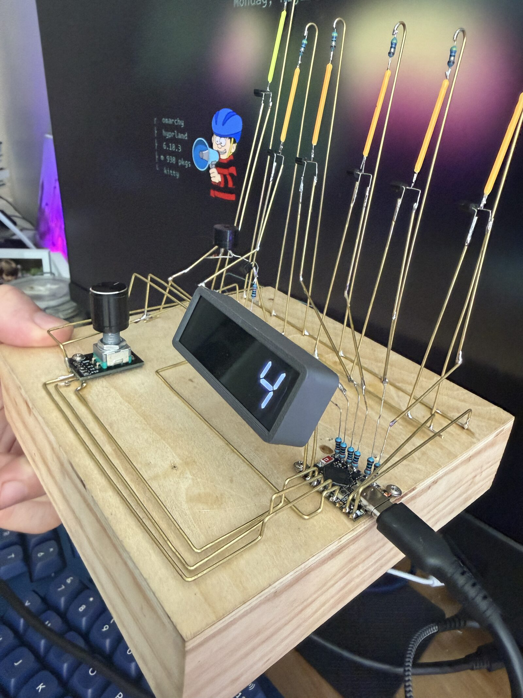
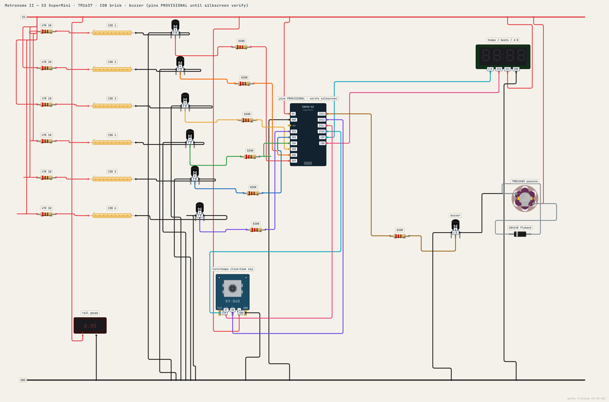
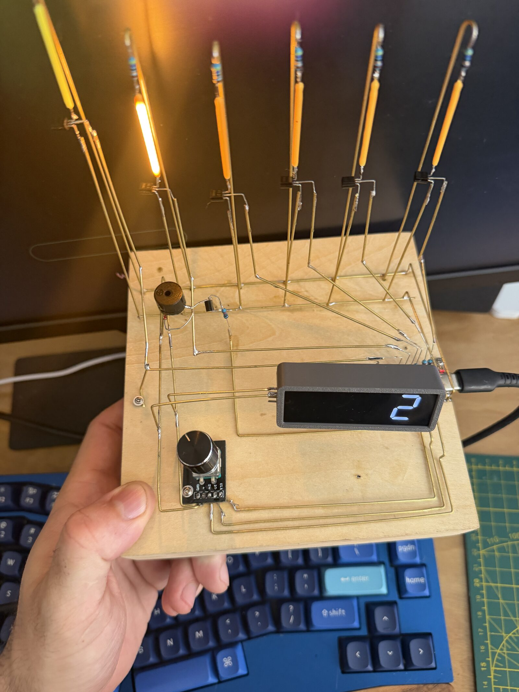
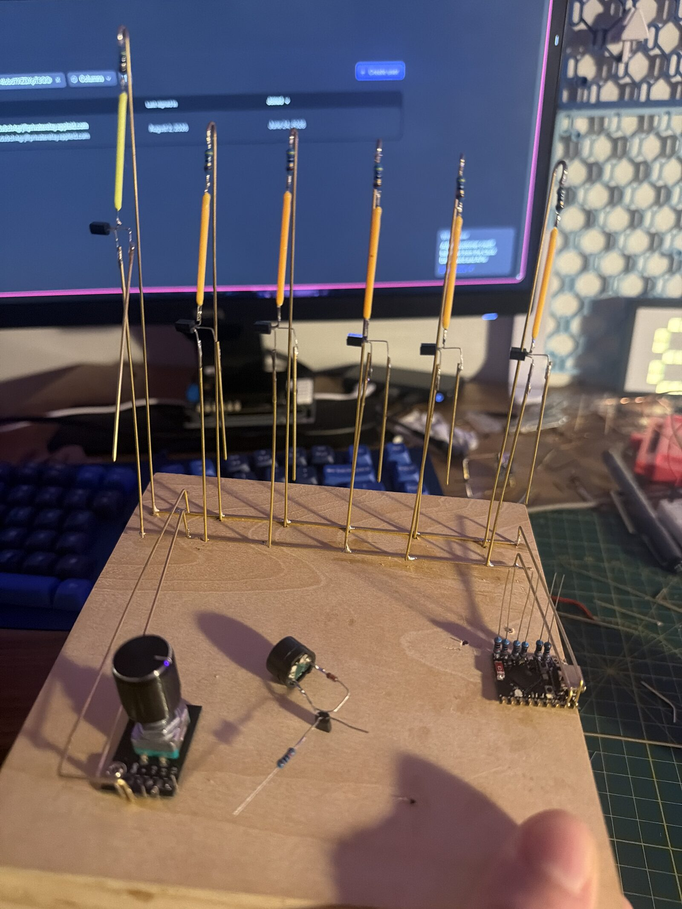
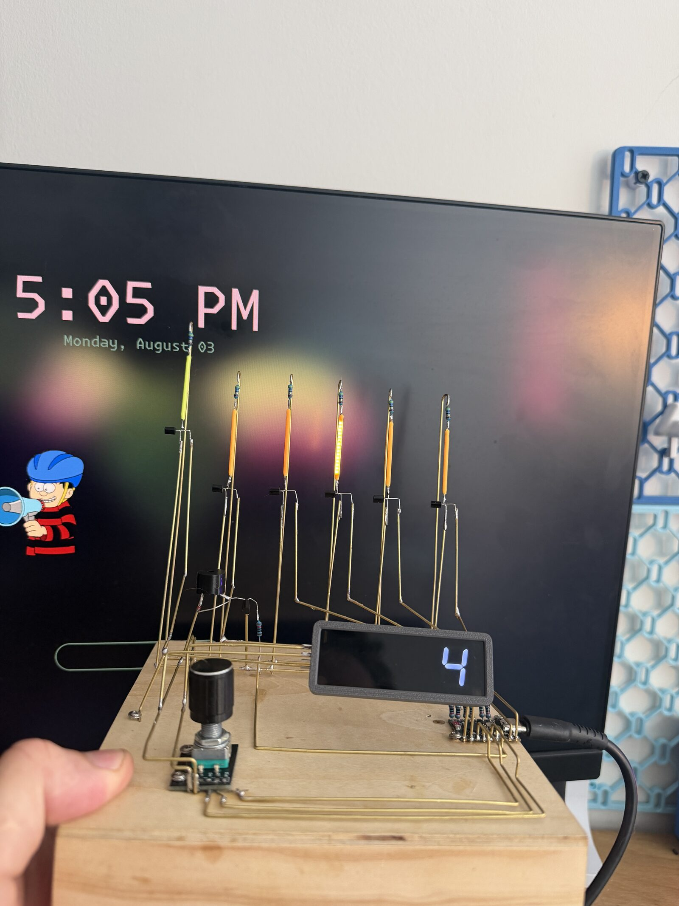

# metronome-2

esp32-s3 metronome. six COB LED filaments chase the beat, TM1637 shows tempo,
KY-040 encoder sets tempo and time signature, passive buzzer does the tock.
runs its own wifi AP and serves a phone remote — default view is a pendulum
that swings in sync with the actual beat timing.



## wiring



| what | pins | notes |
|---|---|---|
| COB filaments 1-6 | 7, 6, 5, 4, 2, 1 | S8050 + 820R per channel, 5V rail |
| TM1637 | CLK 9, DIO 8 | |
| KY-040 | CLK 10, DT 11, SW 12 | polled, no interrupts |
| buzzer (TMB12A05) | 13 | 1k -> NPN low-side, flyback diode |

gpio 3 skipped (strapping). spec in `wiring-metronome-2.json`.

## phone remote

join `Metronome` (pass `metronome`), open `http://192.168.4.1`.

pendulum view by default. `adjust` gets you +/- buttons, type-in bpm, and
time signature. turning the knob quiets the metronome and it restarts on a
downbeat at the new tempo — remote does the same thing through the same code.

api: `GET /api/state`, `/api/bpm?d=N` or `?set=N`, `/api/sig`, `/api/sleep`

double-tap the knob (or hit `shhh` on the adjust page) = deep sleep — a dim SHHH
stays on the display. press the knob to wake.

## build

```sh
pio run -t upload --upload-port /dev/ttyACM0
```

pioarduino core, see `platformio.ini`.

serial hooks at 115200: `+ - t` tempo, `s` sig, `c a` click test, `b` beat
trace, `?` state, `!` event log dump, `W` wifi toggle.

## build photos







MIT
